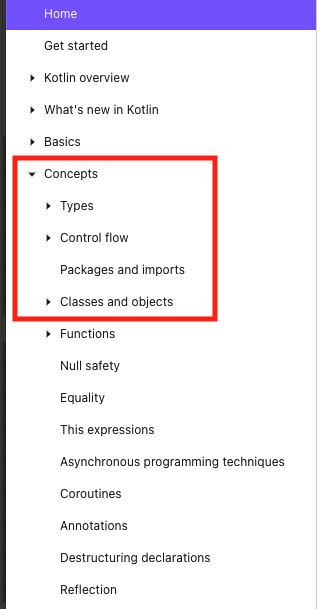

# kotlin-basic
코틀린 언어 학습에 대한 내용 정리

---
## 회의록
#### [최초 모임 회의록(2021.12.12 11:00)](https://github.com/kotlin-serverside-study/kotlin-basic/wiki/%5B211212%5D-1%ED%9A%8C-Meeting-%ED%9A%8C%EC%9D%98%EB%A1%9D)

---

## Week1
### 1주차 학습주제
> 자유 양식으로 markdown 파일을 각자 디렉토리에 Push
* [Kotlin 공식 문서](https://kotlinlang.org/docs/home.html)의 **Concept** 기준 "Classes and Object" 까지의 학습 관련 주제
* 