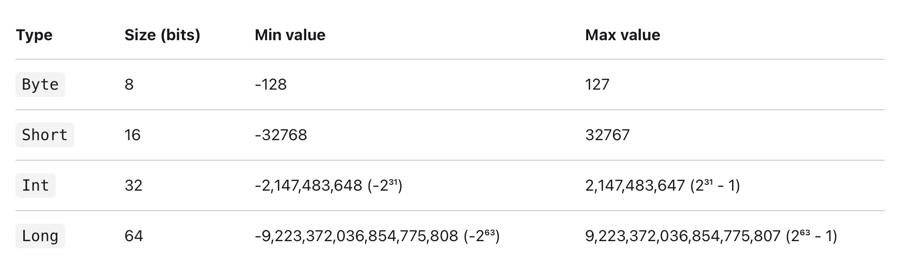
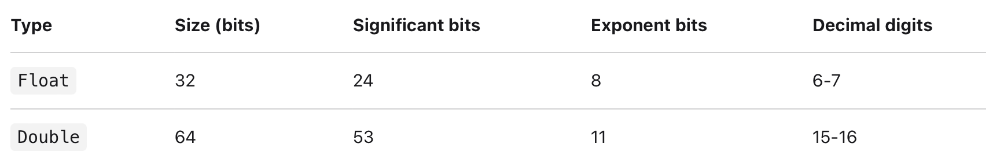

# Kotlin

## Types

---

### Numbers



정수를 할당할 경우, 기본적으로 변수는 Int 타입으로 초기화 됩니다.

Long 타입으로 선언하는 방법.

1. signed기준으로 Int의 크기를 넘는 값을 선언한다. ex) val a = 2,200,000,000
2. 끝에 L을 붙인다. ex) val a = 2L
3. type을 Long으로 지정해준다. ex) val a:Long = 2

Short, Byte 타입으로 선언하는 방법.

type을 지정해준다. ex) val a:Byte = 2  val b:Short = 3

실수의 경우 Kotlin은 [IEEE 754 standard](https://en.wikipedia.org/wiki/IEEE_754) 규정을 따릅니다. 

Float와 Double 타입을 제공합니다.



실수를 할당할 경우, 기본적으로 변수는 Double타입으로 초기화 됩니다.

Float 타입으로 선언하는 방법.

1. 끝에 f 혹은 F를 붙인다. ex) val a = 2.2f val b = 3.3F
2. type을 지정해준다. ex) val a:Float = 2.2

*주의 사항* 코틀린은 implicit widening conversions이 존재하지 않습니다.

### explicit type conversion

- `toByte(): Byte`
- `toShort(): Short`
- `toInt(): Int`
- `toLong(): Long`
- `toFloat(): Float`
- `toDouble(): Double`
- `toChar(): Char`

### Operations

+, -, *, /, %

### **Floating-point numbers comparison**

- Equality checks: `a == b` and `a != b`
- Comparison operators: `a < b`, `a > b`, `a <= b`, `a >= b`
- Range instantiation and range checks: `a..b`, `x in a..b`, `x !in a..b`

---

### Booleans

- `||` – disjunction (logical *OR*)
- `&&` – conjunction (logical *AND*)
- `!` - negation (logical *NOT*)

---

### Characters

Characters타입으로 선언하는 방법.

1. 작은따옴표 (’’)로 선언. ex) val a = ‘1’
2. Char로 타입 선언  ex) val a:Char = ‘1’

character가 digit인 경우에는 Int로 explicit conversion 가능. ( `digitToInt()`)

---

### Strings

sequence of characters

큰따옴표(””)로 선언.

---

### Array

Array 타입으로 선언하는 방법

1. arrayOf() 사용. ex) arayOf(1,2,3) // [1,2,3]
2. Array constructor 사용. ex) val asc = Array(5) { i -> (i * i).toString() }

Array안에 여러 타입 할당 불가 ?

## Control Flow

---

### IF

---

예시 

```kotlin
var max = a
if (a < b) max = b

// With else
var max: Int
if (a > b) {
    max = a
}else {
    max = b
}

// As expression
val max =if (a > b) aelse b
```

이렇게도 사용가능합니다.

```kotlin
val max =if (a > b) {
    print("Choose a")
    a
}else {
    print("Choose b")
    b
}
```

### WHEN

---

예시

```kotlin
when (x) {
    1 -> print("x == 1")
    2 -> print("x == 2")
else -> {
        print("x is neither 1 nor 2")
    }
}
```

### FOR

---

예시

기본

```kotlin
for (item: Intin ints) {
    // ...
}
```

범위 loop

```kotlin
for (i in 1..3) {
println(i)
}
for (i in 6 downTo 0 step 2) {
println(i)
}
```

array index loop

```kotlin
for (i in array.indices) {
println(array[i])
}

for ((index, value) in array.withIndex()) {
println("the element at $index is $value")
}
```

### WHILE

---

예시

```kotlin
while (x > 0) {
    x--
}

do {
val y = retrieveData()
}while (y !=null) // y is visible here!
```

### Returns and Jump expression

---

break, continue를 사용하려면 labeling을 이용해야한다.

name@형식으로 labeling을 할 수 있으며, break+@name, continue+@name으로 반복문을 중지시키거나 다음 iteration으로 넘길 수 있다.

```kotlin
loop@for (iin 1..100) {
for (jin 1..100) {
if (...)break@loop
    }
}
```

Return